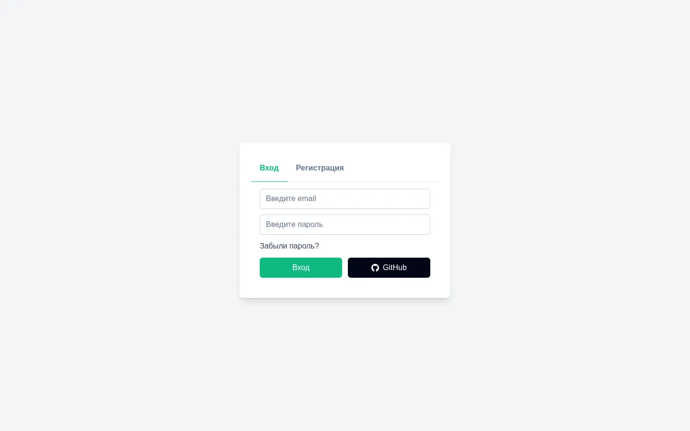
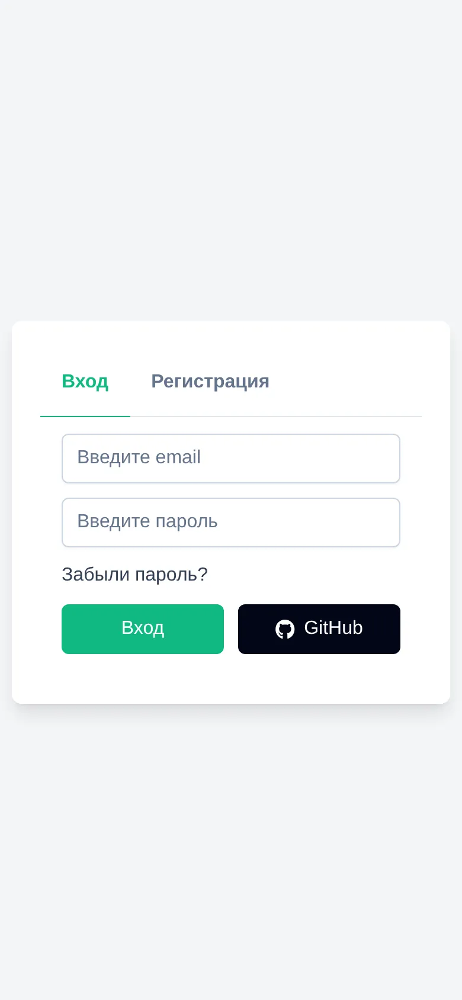

# Link Manager

[English](README.md) | **Русский**

Одностраничное приложение для сохранения, группировки и быстрого доступа к ссылкам на Vue 3, Pinia, PrimeVue и Supabase. Интерфейс на русском.

> 🎓 **Учебный проект** · курс Stepik по Vue 3 + Pinia + Supabase · ноябрь 2025. Начала проект по ходу курса, потом доработала его для портфолио; юнит-тесты и CI добавлены в сентябре 2026.

**Демо:** https://links-manager-mauve.vercel.app/

[](https://github.com/BarbaraFromTonshaevo/links-manager/actions/workflows/ci.yml)   

<p>
  
  
</p>

Зарегистрируйтесь с любым email или войдите через кнопку GitHub (OAuth).

## Ключевое

- **Гард роутера дожидается реальной сессии.** [stores/userStore.js](src/stores/userStore.js) отдаёт промис `authReady`, который резолвится при первом событии `onAuthStateChange`, а роутер его ждёт. Поэтому при перезагрузке защищённой страницы пользователя не выкидывает на `/auth`, пока Supabase восстанавливает сессию.
- **Одна обёртка для состояния запросов.** [composables/useRequest.js](src/composables/useRequest.js) ведёт `loading` и текст ошибки для любого асинхронного вызова; через неё идут все методы `useAuth`.
- **Пагинация и сортировка на стороне базы.** Стор ссылок использует range-запросы Supabase с `count: 'exact'` и сортирует по `click_count` или `created_at`, так что за раз грузится одна страница из 6 ссылок.
- **Доступ к данным через Row Level Security.** Anon-ключ лежит во фронтенде, а каждая таблица защищена RLS-политиками, чтобы пользователь видел только свои данные.
- **Тесты и CI.** Vitest покрывает `useRequest`, `useAuth`, `userStore` и `linksStore` с замоканным клиентом Supabase; GitHub Actions запускает линтер, тесты и сборку на каждый push и pull request в `main`.

## Возможности

- Регистрация и вход по email и паролю, вход через GitHub OAuth, сброс пароля по email.
- Защищённые маршруты: неавторизованных перенаправляет на `/auth`, авторизованных туда не пускает.
- Добавление, редактирование и удаление ссылок с названием, URL, описанием и категорией; в превью показывается фавикон сайта.
- Создание и удаление своих категорий.
- Избранное, копирование ссылки в буфер обмена; каждый переход по ссылке считается.
- Фильтр «только избранное», сортировка по популярности, пагинация «Показать ещё».
- Валидация форм на Zod через `@primevue/forms`.
- Toast-уведомления на каждое действие.

## Стек

| Область | Инструменты |
| --- | --- |
| Фреймворк | Vue 3 (`<script setup>`, Composition API), Vite |
| Состояние | Pinia (setup-сторы) |
| Роутинг | Vue Router 4 |
| UI | PrimeVue 4, Tailwind CSS 4 (`tailwindcss-primeui`) |
| Валидация | Zod через `@primevue/forms` |
| Бэкенд | Supabase (Postgres, Auth, Row Level Security) |
| Тесты | Vitest, jsdom |
| Качество кода | ESLint, Prettier, GitHub Actions |
| Хостинг | Vercel |

## Архитектура

```
Supabase Auth ──► stores/userStore.js ──► гард роутера ──► views/AuthView, views/HomeView
                  (user, authReady)

Supabase DB ────► stores/linksStore.js ──► views/HomeView ──► components/CardLink.vue
                  (ссылки, фильтры, страница)
            ◄──── components/Modals/  (категории, создание / редактирование ссылки)
```

1. [supabase.js](src/supabase.js) создаёт один клиент Supabase из `VITE_SUPABASE_URL` и `VITE_SUPABASE_KEY`.
2. [stores/userStore.js](src/stores/userStore.js) подписывается на `onAuthStateChange` и хранит текущего пользователя.
3. [router/index.js](src/router/index.js) ждёт `authReady` в `beforeEach` и перенаправляет по `meta.requiresAuth`.
4. [composables/useAuth.js](src/composables/useAuth.js) оборачивает все вызовы Supabase Auth в `handleRequest` из `useRequest`.
5. [stores/linksStore.js](src/stores/linksStore.js) грузит ссылки постранично с текущими фильтрами и обновляет избранное, клики и удаление.
6. Модалки в [components/Modals/](src/components/Modals/) читают и пишут категории и ссылки напрямую через клиент Supabase.

### Ключевые решения

- **Deferred-промис для готовности авторизации.** `onAuthStateChange` — это подписка, а не запрос, поэтому стор сохраняет `resolve` промиса и вызывает его из колбэка. `isReady` отличает «ещё не знаем» от «сессии нет».
- **Фавиконы вместо загруженных картинок.** Превью — это URL сервиса фавиконов Google, собранный из домена ссылки, так что ничего загружать не нужно.

## Структура проекта

```
src/
├── components/
│   ├── AuthForm/        # формы входа, регистрации, сброса и задания нового пароля
│   ├── Modals/          # диалоги создания/редактирования ссылки и категорий
│   ├── CardLink.vue     # карточка ссылки: избранное, копирование, редактирование, удаление
│   ├── TheFilters.vue   # фильтры «избранное» / «популярные»
│   └── TheHeader.vue    # шапка
├── composables/
│   ├── useAuth.js             # регистрация, вход, выход, сброс пароля, GitHub OAuth
│   ├── useRequest.js          # общее состояние загрузки и ошибки для асинхронных вызовов
│   └── useToastNotifications.js
├── stores/
│   ├── linksStore.js    # список ссылок, пагинация, фильтры
│   └── userStore.js     # текущий пользователь, authReady
├── router/              # маршруты и гард авторизации
├── views/               # AuthView, HomeView, ResetPassword
└── supabase.js          # клиент Supabase
```

Тесты лежат рядом с кодом как `*.test.js`.

## Запуск

Нужны Node.js `^20.19.0` или `>=22.12.0` и проект в [Supabase](https://supabase.com/).

```bash
npm install
cp .env.example .env
npm run dev          # http://localhost:5173
```

Другие скрипты:

```bash
npm run build        # продакшен-сборка
npm run preview      # просмотр продакшен-сборки
npm run lint         # ESLint с автоисправлением
npm run format       # Prettier
npm run test         # Vitest в watch-режиме
npm run test:ci      # Vitest, один прогон
```

| Переменная | По умолчанию | Назначение |
| --- | --- | --- |
| `VITE_SUPABASE_URL` | — | URL проекта Supabase (Project Settings → API) |
| `VITE_SUPABASE_KEY` | — | anon-ключ Supabase; во фронтенде безопасен только с включённым RLS |

В базе нужны три таблицы, у каждой включён Row Level Security:

- `users` — `id` (uuid, ссылается на `auth.users`), `firstname`, `email`
- `categories` — `id`, `name`
- `links` — `id`, `name`, `url`, `description`, `category` (ссылается на `categories.id`), `is_favorite`, `click_count`, `preview_image`, `user_id` (ссылается на `auth.users`), `created_at`

Для GitHub OAuth и писем сброса пароля настройте провайдер и redirect URL в разделе Authentication → URL Configuration панели Supabase.

## Деплой

Задеплоено на Vercel как статическая сборка Vite; переменные Supabase заданы в проекте Vercel.

## Известные ограничения

- **Регистрация не атомарная.** `auth.signUp` и вставка в `public.users` — два отдельных запроса. Если вставка падает, пользователь есть в `auth.users`, но без строки в `public.users`: ошибка показывается, но пользователь остаётся залогиненным и не может зарегистрироваться повторно с тем же email.

## Что бы я улучшила

- **Поиск по названию и фильтр по категории**, а не только по избранному.
- **Атомарный счётчик кликов** через функцию Postgres, вызываемую через `rpc`.
- **Триггер в базе для новых пользователей**, который создаёт строку в `public.users` при регистрации, чтобы обе записи происходили в одной транзакции.
- **Тесты для компонентов**; `useAuth`, `useRequest`, `userStore` и `linksStore` уже покрыты.
- **Тёмная тема**: PrimeVue и Tailwind её уже поддерживают.
- **TypeScript.**
